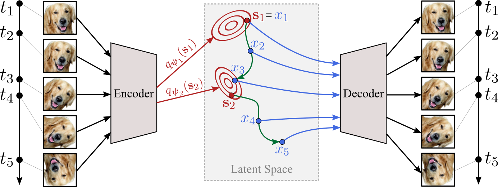

# Latent Neural ODEs with Sparse Bayesian Multiple Shooting



## Installation

```bash
git clone https://github.com/yakovlev31/msvi.git
cd msvi
pip install -r requirements.txt
pip install -e .
```

## Getting Started

### Data Generation

First, you might want to generate the data. Data generating notebooks are located at `./experiments/data/scripts/`. Simply launch one of the notebooks to generate a dataset. Datasets are saved to `./experiments/data/datasets/`.

If you want to use your own dataset, follow the scripts in `./msvi/utils/`.

### Training/validation/testing

```bash
python experiments/{pendulum,rmnist,bballs}/train.py --name mymodel --device cuda
python experiments/{pendulum,rmnist,bballs}/val.py --name mymodel --device cuda
python experiments/{pendulum,rmnist,bballs}/test.py --name mymodel --device cuda
```

See `./msvi/utils/{pendulum,rmnist,bballs}.py` for all command line arguments.
